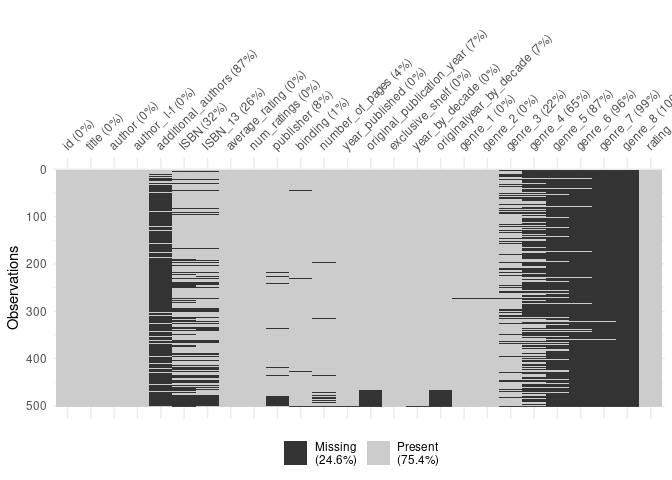
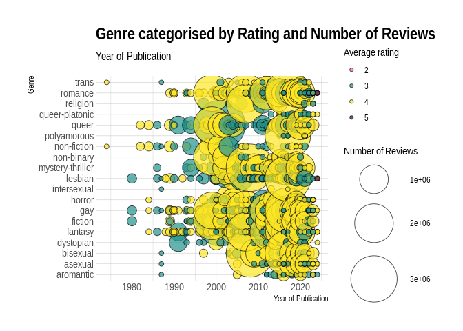

Project proposal
================
Queer Lit

``` r
library(tidyverse)
library(broom)
library(readr)
library(stringr)
library(readxl)
library(dplyr)
library(hexbin)
library(visdat)
library(naniar)
library(UpSetR)
library(ggplot2)
library(hrbrthemes)
library(tidyr)
library(viridis)
library(ggridges)
```

## 1. Introduction

General Research Question: Examining the correlation between the number
of Reviews a book receives and the Rating. Understanding a possible
evolution of queer literature from the 1970s - 2024.

Examining the general relation between reviews and rating from the
Goodreads rating system. The data has been formulated from Goodreads
lists and can be found here:

Queer_books-data -
<https://docs.google.com/spreadsheets/d/11cubO21f_MJb85e4IrpsaNH9Sm4-6B8-kL2CnUNGGdE/edit>  
Kandi Grey Queer Lit Shelf -
<https://www.goodreads.com/review/list/59261401-kandi-grey?shelf=queer-books_all>

The variables include id (Id number of book from), Title, Author (Last
name, First name), Additional Authors, ISBN, ISBN13, Average Rating ( 1-
5), Num Rating (Number of Ratings), Publisher, Binding (Paperback,
Hardcover, eBook, ect), Number of Pages, Year Published, Original
Publication Year, Exclusive Shelf (File name). 500 observations have
been recorded. Goodreads is a site and a tool used by people to
categorise books they have written and read. Goodreads has different
ways to help users categorise books; I created a ‘bookshelf’ to collect
books from Lists that other Goodreads users supplied. I collected the
top 500 from several Queer Literature lists to create the dataset we are
using. Using this data, we can examine the correlation between the
Average Rating and the Number of Reviews received, if the Binding method
is related to the year published, if there is a common publisher for
Queer literature. Possible Further Study: Examining the relation to
genre within Queer Literature. The differences across the queer
spectrum.

Vocabulary Definitions: Queer: does not fall under the
heterosexual/romantic spectrum, i.e. falls under the LGBTQIA+ spectrum
Queer Literature Definition: literature either written by an author that
identifies as queer, the themes of the book itself are queer related,
either through character, theme, topic ect.

## 2. Data

``` r
queer_books_data <- read_excel("../data/queer-books_data.xlsx")
book_genre <- read_excel("../data/data_genre (1).xlsx")
```

Codebook

id: Book number

title: Book title

author: Book author

author l-f: Book author last name and then first name

additional_authors: Additional author beside the first author

ISBN: Book identifier number

ISBN_13: Book identifier number with 13-digits long

average_rating: Book average rating

num_rating: Total number of rating

publisher: Book publisher

binding: Book binding type

number_of_pages: Number of pages of the book

year_published: Book’s year published (first and/or latest publication)

original_publication_year: First publication year

exclusive-shelf:file name

``` r
glimpse(queer_books_data)
```

    ## Rows: 500
    ## Columns: 15
    ## $ id                        <dbl> 19351, 96986, 48037, 5297, 323455, 53064, 53…
    ## $ title                     <chr> "The Epic of Gilgamesh", "Plato Symposium (H…
    ## $ author                    <chr> "Anonymous", "Plato", "J. Sheridan Le Fanu",…
    ## $ `author_ l-f`             <chr> "Anonymous, Anonymous", "Plato, Plato", "Fan…
    ## $ additional_authors        <chr> "N.K. Sandars, John Maier, Herbert Mason, Jo…
    ## $ ISBN                      <chr> "1.41026286E8", "8.7220076E8", "8.09510839E8…
    ## $ ISBN_13                   <dbl> 9.780141e+12, 9.780872e+12, 9.780810e+12, NA…
    ## $ average_rating            <dbl> 3.72, 4.08, 3.85, 4.12, 4.22, 3.90, 3.70, 3.…
    ## $ num_ratings               <dbl> 94267, 70111, 109904, 1510379, 20296, 16738,…
    ## $ publisher                 <chr> "Penguin Books Limited", "Hackett Publishing…
    ## $ binding                   <chr> "Paperback", "Paperback", "Paperback", "Pape…
    ## $ number_of_pages           <dbl> 120, 109, 108, 272, 188, 384, 142, 194, 336,…
    ## $ year_published            <dbl> 2006, 1989, 2000, 2004, 1993, 1999, 2005, 20…
    ## $ original_publication_year <dbl> -1200, -380, 1872, 1890, 1897, 1911, 1912, 1…
    ## $ exclusive_shelf           <chr> "queer-books_all", "queer-books_all", "queer…

## 3. Ethics review

Limitations: The data is subjective, as it comes from Kandi’s personal
Goodreads profile and contains personal bias. It also a selection of 500
books from different queer book lists provided on Goodreads, which
contains human bias for literature. The Goodreads system has a voting
and review system that relies on human interaction, and therefore human
subjectivity. The lack of information generated to fully comprehend the
data is also limited in that there are variables not included within the
data collected e.g. Country of origin, languages published in, gender of
author - which would be significant to include when discussing the point
of representation within literature. The are also limitations within the
form of data collected: literature. The variables do not include a
labeling system for Adult, New Adult, Young Adult, or Children. The
genres given are broad sense of what the books contains and not
specifics e.g. the label Fantasy includes Sci-fi and High Fantasy which
don’t share many common literary aspects other than both being Fantasy.

Positive Effects: There is a lack of presented queer data regarding
literature and this data would be a stepping point for future projects
to understand how representation is important within communities - the
data covers a spectrum of queer representation but it only a sample.
Some of the queer identities include: asexuality, aromantic, gay,
lesbian, trans and more. The positive effect of this is the initiative
to start, to foster curiosity and awareness of these subjects. If this
project to were be expanded using full Goodreads lists (or attempting to
categorical analyse every book ever uploaded) rather than a sample from
Kandi’s personal profile, the impact would be useful in understanding
the trends within literature over time, if there has been an increase,
speculation on the relationship between queer authors and the works that
they write, and the links to a more international community.

Negative Effects: As the data is taken from a personal account, the
negative repercussions (if there are any) would fall directly on Kandi
due to personal connection. There is a possibility for
misinterpretations within the real world due to the limitations placed
on the data mentioned above.

Minimizing Negative Impacts: Through communicating clearly what the data
includes and does not include, how the personal bias affects the data
collected, hopefully the points of misinterpretations and
misconstructions can be minimized. This project is supposed to represent
the possibilities of analysis that can be done within the literary world
from a queer perspective, and the specifics within queer literature.

## 4. Data analysis plan

#### Correlation between number of rating and average rating

``` r
queer_books_data %>% 
  ggplot(aes( x = num_ratings, y = average_rating)) +
  geom_hex() +
  scale_fill_viridis_b() +
  labs( title = "Correlation of average rating and number of rating",
        subtitle = "Goodread data from 1974 - 2024",
        x = "Number of rating",
        y = "Average rating")
```

<!-- -->

#### Check correltion of top rating and number of rating

check whether the high average rating has high number of rating.
Checked: there is no overlap between the average rating and the number
of rating.

``` r
Top_ten_ave <- queer_books_data %>% 
  select(title, average_rating) %>% 
  arrange(desc(average_rating)) %>% 
  slice(1:10)

bottom_ten_ave <- queer_books_data %>% 
  select(title, average_rating) %>% 
  arrange((average_rating)) %>% 
  slice(1:10)

Top_ten_num <- queer_books_data %>% 
  select(title, num_ratings) %>% 
  arrange(desc(num_ratings)) %>% 
  slice(1:10)

bottom_ten_ave %>% 
  left_join(Top_ten_num, by = "title")
```

    ## # A tibble: 10 × 3
    ##    title                                            average_rating num_ratings
    ##    <chr>                                                     <dbl>       <dbl>
    ##  1 The Loveless Princess                                      2.8           NA
    ##  2 This Song Is (Not) for You                                 3.04          NA
    ##  3 We Awaken                                                  3.16          NA
    ##  4 Ace of Hearts                                              3.18          NA
    ##  5 That Inevitable Victorian Thing                            3.21          NA
    ##  6 In My Dreams (Aces in Love #1)                             3.25          NA
    ##  7 The Once and Future Queen, Vol. 1: Opening Moves           3.26          NA
    ##  8 Before I Let Go                                            3.33          NA
    ##  9 Overleveled, Underloved                                    3.33          NA
    ## 10 Coffee Cake (Coffee Cake, #1)                              3.34          NA

``` r
Top_ten_ave %>% 
  left_join(Top_ten_num, by = "title")
```

    ## # A tibble: 10 × 3
    ##    title                                              average_rating num_ratings
    ##    <chr>                                                       <dbl>       <dbl>
    ##  1 The Seemingly Impossible Love Life of Amanda Dean            5             NA
    ##  2 No FREE Attention: How Women use The Possibility …           4.91          NA
    ##  3 To a Darker Shore                                            4.79          NA
    ##  4 Nonbinary                                                    4.78          NA
    ##  5 The Midnight Strider (The Chronomancer Chronicles…           4.76          NA
    ##  6 Thirteenth                                                   4.74          NA
    ##  7 The Blue Codex (The Blue Codex, #1)                          4.7           NA
    ##  8 Earthflown                                                   4.65          NA
    ##  9 Heartstopper: Volume Four (Heartstopper, #4)                 4.61          NA
    ## 10 Crooked Kingdom (Six of Crows, #2)                           4.6           NA

#### Mutate year to decade

``` r
queer_books_data <- queer_books_data %>% 
  mutate(year_by_decade = case_when(year_published %in% c("1970","1971", "1972", "1973", "1974","1975", "1976", "1977", "1978", "1979") ~ "1970s",
                                    year_published %in% c("1980","1981", "1982","1983","1984","1985","1986","1987","1988","1989") ~ "1980s",
                                    year_published %in% c("1990","1991","1992","1993","1994","1995","1996","1997","1998","1999") ~ "1990s",
                                    year_published %in% c("2000","2001","2002","2003","2004","2005","2006","2007","2008","2009") ~ "2000s",
                                    year_published %in% c("2010","2011","2012","2013","2014","2015","2016","2017","2018","2019") ~ "2010s",
                                    year_published %in% c("2020","2021","2022","2023","2024") ~ "2020s"))
```

``` r
queer_books_data <- queer_books_data %>% 
  mutate(originalyear_by_decade = case_when(original_publication_year %in% c("1897","1890", "1872","-380","-1200") ~ "<1900s",
                                            original_publication_year %in% c("1910","1911", "1912","1913","1914","1915","1916","1917","1918","1919") ~ "1910s",
                                            original_publication_year %in% c("1920","1921", "1922","1923","1924","1925","1926","1927","1928","1929") ~ "1920s",
                                            original_publication_year %in% c("1930","1931", "1932","1933","1934","1935","1936","1937","1938","1939") ~ "1930s",
                                            original_publication_year %in% c("1940","1941", "1942","1943","1944","1945","1946","1947","1948","1949") ~ "1940s",
                                            original_publication_year %in% c("1950","1951", "1952","1953","1954","1955","1956","1957","1958","1959") ~ "1950s",
                                            original_publication_year %in% c("1960","1961", "1962","1963","1964","1965","1966","1967","1968","1969") ~ "1960s",
                                            original_publication_year %in% c("1970","1971", "1972", "1973", "1974","1975", "1976", "1977", "1978", "1979") ~ "1970s",
                                    original_publication_year %in% c("1980","1981", "1982","1983","1984","1985","1986","1987","1988","1989") ~ "1980s",
                                    original_publication_year %in% c("1990","1991","1992","1993","1994","1995","1996","1997","1998","1999") ~ "1990s",
                                    original_publication_year %in% c("2000","2001","2002","2003","2004","2005","2006","2007","2008","2009") ~ "2000s",
                                    original_publication_year %in% c("2010","2011","2012","2013","2014","2015","2016","2017","2018","2019") ~ "2010s",
                                    original_publication_year %in% c("2020","2021","2022","2023","2024") ~ "2020s"))
```

#### Visualise second and original publication by decade

``` r
queer_books_data %>% 
  ggplot(aes( x = year_by_decade)) +
  geom_bar()
```

<!-- -->

``` r
queer_books_data %>% 
  ggplot(aes( x = originalyear_by_decade, fill = average_rating)) +
  geom_bar()
```

    ## Warning: The following aesthetics were dropped during statistical transformation: fill
    ## ℹ This can happen when ggplot fails to infer the correct grouping structure in
    ##   the data.
    ## ℹ Did you forget to specify a `group` aesthetic or to convert a numerical
    ##   variable into a factor?

<!-- --> \####
Visualise the change of binding’s types by decade

``` r
queer_books_data %>%
  ggplot(aes( x = year_by_decade, fill = binding)) +
  geom_bar(alpha = 0.7) +
  scale_fill_viridis_d() +
  labs(title = "Binding types's frequency",
       x = NULL, y = NULL) 
```

<!-- -->

#### Visualise the change of binding’s types by year

``` r
queer_books_data %>%
  ggplot(aes( x = year_published, fill = binding)) +
  geom_bar(alpha = 0.7) +
  scale_fill_viridis_d()
```

    ## Warning: Removed 2 rows containing non-finite values (`stat_count()`).

<!-- -->

#### Filter book that got republished

``` r
republished_book <- queer_books_data %>% 
  filter(year_published != original_publication_year)

#ggplot(data = republished_book,
 #      mapping = aes( x = year_published, y = original_published)) +
  #geom_point() ##what would be a good geom to visualize this data. 
```

#### Check top publishers

Look at which publisher has more number of book published.

``` r
queer_books_data %>% 
  count(publisher) %>% 
  arrange(desc(n))
```

    ## # A tibble: 285 × 2
    ##    publisher                                       n
    ##    <chr>                                       <int>
    ##  1 <NA>                                           39
    ##  2 Less Than Three Press                          14
    ##  3 Vintage                                        12
    ##  4 Dreamspinner Press                             10
    ##  5 Little, Brown Books for Young Readers           8
    ##  6 CreateSpace Independent Publishing Platform     7
    ##  7 DAW                                             7
    ##  8 Spectra                                         7
    ##  9 Tor Books                                       7
    ## 10 Ace                                             6
    ## # ℹ 275 more rows

#### Merge genre to primary dataset

Try to make a similar graph for all the genre

``` r
book_genre <- book_genre %>% 
  select("title", "genre_1", "genre_2", "genre_3", "genre_4", "genre_5", "genre_6", "genre_7", "genre_8")


queer_books_genre <- queer_books_data %>% 
  left_join(book_genre, by = c("title" = "title"))
```

    ## Warning in left_join(., book_genre, by = c(title = "title")): Detected an unexpected many-to-many relationship between `x` and `y`.
    ## ℹ Row 248 of `x` matches multiple rows in `y`.
    ## ℹ Row 33 of `y` matches multiple rows in `x`.
    ## ℹ If a many-to-many relationship is expected, set `relationship =
    ##   "many-to-many"` to silence this warning.

``` r
queer_books_genre %>% 
  ggplot(aes(x = fct_rev(fct_infreq(genre_1)), fill = binding)) +
  geom_bar(alpha=0.7) +
  coord_flip() +
  scale_fill_viridis_d() +
  labs( x = "genre")
```

<!-- -->

#### Categorise the average rating

``` r
queer_books_genre <- queer_books_genre %>% 
  mutate(rating_categories = case_when(str_starts(average_rating, pattern = "2")~"2",
                                       str_starts(average_rating, pattern = "3")~"3",
                                       str_starts(average_rating, pattern = "4")~"4",
                                       str_starts(average_rating, pattern = "5")~"5"))
```

#### Compare the books’ rating of the top publishers

Look at the books’ title published by the top five of most frequent
publishers. Then look at the correlation of these books’ average ratings
and number of ratting.

``` r
Books_and_publishers <- queer_books_genre %>% 
  filter(publisher %in% c("Less Than Three Press", "Vintage", "Dreamspinner Press", "Little, Brown Books for Young Readers", "CreateSpace Independent Publishing Platform", "DAW", "Spectra", "Tor Books", "NA")) 

ggplot(data = Books_and_publishers,
       mapping = aes( y = fct_rev(fct_infreq(publisher)), fill = "rating_categories")) +
  geom_bar() +
  scale_fill_viridis_d() +
  labs(title = "Publishers and their books rating",
       subtitle = "Correlation of books in top publishers and their average rating",
       x = NULL, y = NULL) +
  guides(fill = "none")
```

<!-- -->

#### Check missing data

``` r
vis_miss(queer_books_genre)
```

<!-- -->

``` r
queer_books_genre %>% 
  as_shadow_upset() %>% 
  upset()
```

<!-- -->

#### Genres’ average rating

``` r
all_book_genre <- queer_books_genre %>% 
  pivot_longer(cols = genre_1:genre_8, names_to = c("genre_1", "genre_2", "genre_3", "genre_4", "genre_5", "genre_6", "genre_7", "genre_8"), names_pattern = "(_)(_)(_)(_)(_)(_)(_)(_)", values_to = "all_genre", values_drop_na = TRUE) %>% 
  select(!genre_1:genre_8) 

all_book_genre %>% 
  ggplot(aes(x = fct_rev(fct_infreq(all_genre)), fill = rating_categories)) +
  geom_bar() +
  coord_flip() +
  scale_fill_viridis_d() +
  labs(title = "Genres' average rating",
       x = "genre",
       fill = "average rating")
```

<!-- -->

#### Books’ genre in each top publishers

``` r
books_publisher_genre <- Books_and_publishers %>% 
   pivot_longer(cols = genre_1:genre_8, names_to = c("genre_1", "genre_2", "genre_3", "genre_4", "genre_5", "genre_6", "genre_7", "genre_8"), names_pattern = "(_)(_)(_)(_)(_)(_)(_)(_)", values_to = "all_genre", values_drop_na = TRUE) %>% 
  select(!genre_1:genre_8) 

books_publisher_genre %>% 
  ggplot(aes(x = fct_rev(fct_infreq(all_genre)), fill = publisher)) +
  geom_bar() +
  coord_flip() +
  scale_fill_viridis_d() +
  labs(title = "Books' genre of top publishers",
       x = "genre",
       fill = "publishers")
```

<!-- -->

#### Books’ genre in each top publishers by rating

``` r
books_publisher_genre %>% 
  ggplot(aes(x = fct_rev(fct_infreq(all_genre)), fill = publisher)) +
  geom_bar() +
  coord_flip() +
  scale_fill_viridis_d() +
  facet_wrap(~rating_categories) +
  labs(title = "Books' genre and average rating of top publisher",
       x = "genre",
       fill = "average rating")
```

<!-- -->

#### Visualise books’ average rating and number of rating in each year by genre (only top publishers’s books)

``` r
books_publisher_genre %>% 
  ggplot(aes(x = all_genre, y = year_published, size = num_ratings, fill = rating_categories)) +
  geom_point(alpha=0.7, shape = 21, color = "black") +
  coord_flip() +
  scale_fill_viridis_d() +
  theme_ipsum() +
  labs(title = "Books' genre and average rating of top publisher",
       x = "genre",
       y = "publication year",
       color = "average rating",
       size = "number of rating")
```

<!-- -->

#### Visualise books’ average rating and number of rating in each year by genre (all the books)

``` r
all_book_genre %>% 
  ggplot(aes(x = all_genre, y = year_published, size = num_ratings, fill = rating_categories)) +
  geom_point(alpha=0.7, shape = 21, color = "black") +
  coord_flip() +
  scale_fill_viridis_d() +
  theme_ipsum() +
  labs(title = "Books' genre and average rating by year",
       x = "genre",
       y = "publication year",
       fill = "average rating",
       size = "number of rating")
```

    ## Warning: Removed 5 rows containing missing values (`geom_point()`).

<!-- -->

``` r
book_genre %>% 
  pivot_longer(cols = genre_1:genre_8, names_to = c("genre_1", "genre_2", "genre_3", "genre_4", "genre_5", "genre_6", "genre_7", "genre_8"), names_pattern = "(_)(_)(_)(_)(_)(_)(_)(_)", values_to = "all_genre", values_drop_na = TRUE) %>% 
  select(!genre_1:genre_8) 
```

    ## # A tibble: 1,664 × 2
    ##    title                       all_genre
    ##    <chr>                       <chr>    
    ##  1 Welcome to Your Afterlife   aromantic
    ##  2 Welcome to Your Afterlife   asexual  
    ##  3 Welcome to Your Afterlife   bisexual 
    ##  4 Welcome to Your Afterlife   fantasy  
    ##  5 Welcome to Your Afterlife   romance  
    ##  6 Hazel's Theory of Evolution aromantic
    ##  7 Hazel's Theory of Evolution asexual  
    ##  8 Hazel's Theory of Evolution fiction  
    ##  9 The Bone People             aromantic
    ## 10 The Bone People             asexual  
    ## # ℹ 1,654 more rows

``` r
#book_genre <- mutate(book_genre, type = genre_all(c("genre_1", "genre_2", "genre_3", "genre_4", "genre_5", "genre_6", "genre_7", "genre_8")))
#  ggplot(aes(x = "all_genre"))+
#  geom_point()
```

``` r
# book_genre %>% 
 # pivot_wider(id_cols = c(genre_1, genre_2, genre_3, genre_4, genre_4, genre_5, genre_6, genre_7, genre_8),
 #             names_from = genre_1,
  #            values_from = (c(genre_1, genre_2, genre_3, genre_4, genre_4, genre_5, genre_6, genre_7, genre_8)))
```
